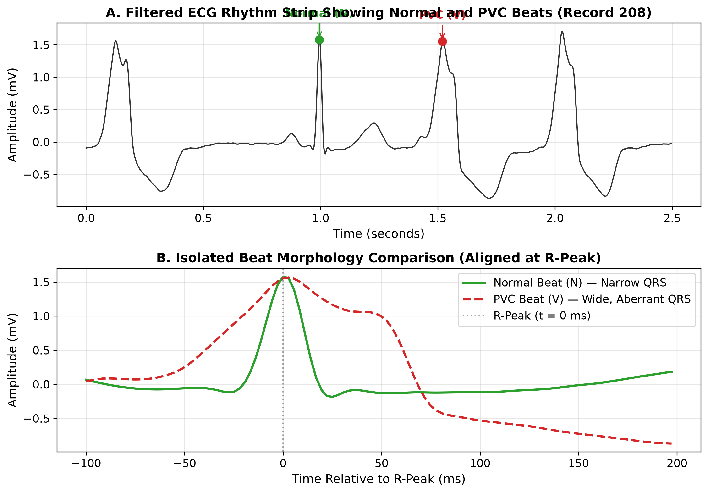
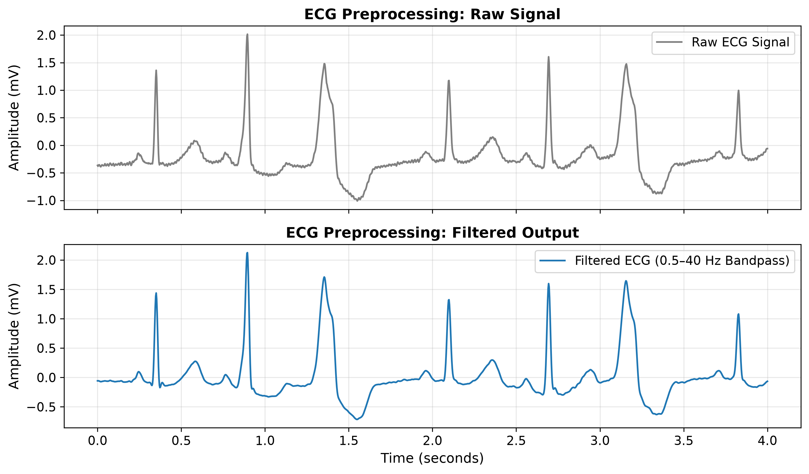
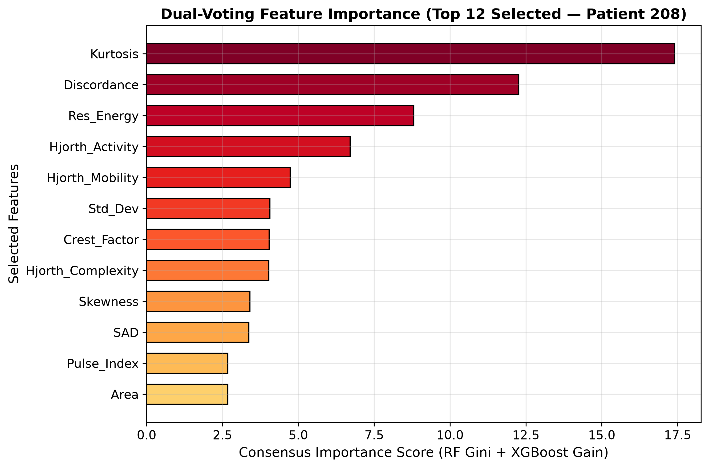
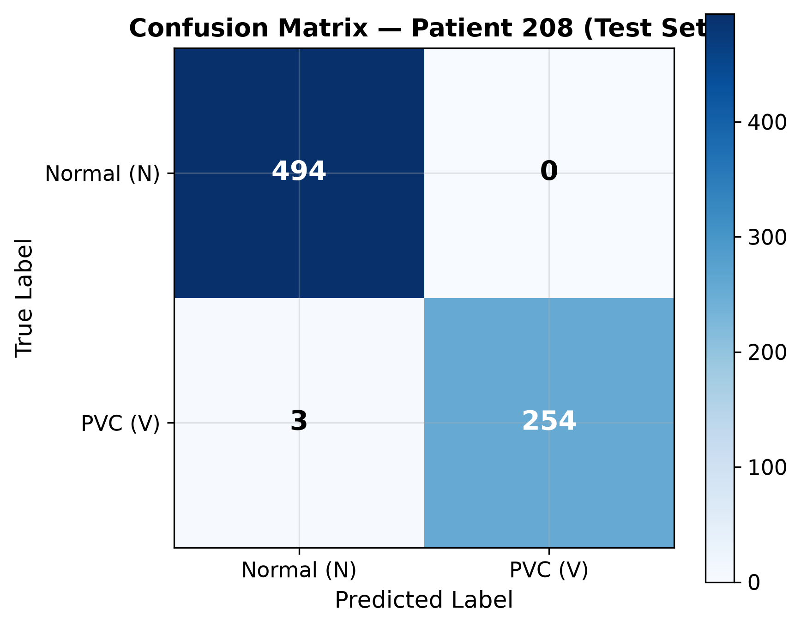
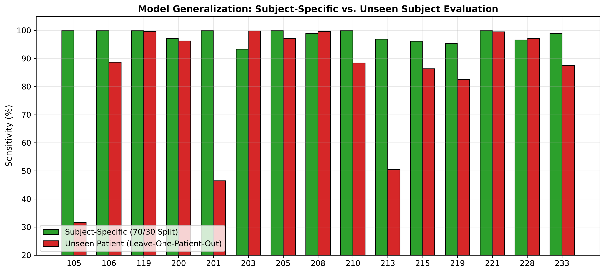

# Lightweight ECG-Based PVC Detection Using Machine Learning

> **Undergraduate Biomedical Engineering Academic Project**

[](https://www.python.org/)
[](LICENSE)
[](run_tests.py)

---

## 1. Overview

An electrocardiogram (ECG) records the electrical activity of the heart over time. A Premature Ventricular Contraction (PVC) is an abnormal heartbeat that originates in the ventricles instead of the sinoatrial node, disrupting the normal heart rhythm. Frequent PVCs can be a marker of underlying heart conditions.

In many resource-limited clinic settings, manual review of long ECG recordings is time-consuming. This project implements a simple, lightweight machine-learning pipeline to detect PVC beats from single-lead ECG signals.



---

## 2. Project Goal

The goal of this project is to classify individual ECG heartbeats as either **Normal (`N`)** or **Premature Ventricular Contraction (`V`)** using simple, hand-crafted ECG features and a lightweight Decision Tree classifier.

---

## 3. Dataset

This project uses the standard **[MIT-BIH Arrhythmia Database](https://physionet.org/content/mitdb/1.0.0/)** hosted on PhysioNet.

* **Sampling Frequency:** 360 Hz
* **Lead:** Channel 0 (Modified Limb Lead II / MLII)
* **Cohort:** 15 patient records containing both normal and PVC beats:
  `105`, `106`, `119`, `200`, `201`, `203`, `205`, `208`, `210`, `213`, `215`, `219`, `221`, `228`, `233`.
* **Beat Annotations:** We use the physician-verified beat labels provided with the database:
  * `N`: Normal sinus beat (Class 0)
  * `V`: Premature ventricular contraction (Class 1)
* **Annotation Usage:** The reference annotations provide the R-peak sample index for beat segmentation and the true class label for supervised training and testing.

---

## 4. Method

The detection pipeline consists of six sequential steps:

```text
Raw ECG Signal
      ↓
Preprocessing (0.5 – 40 Hz Butterworth Bandpass Filter)
      ↓
Beat Extraction (300 ms window: 100 ms pre-R, 200 ms post-R)
      ↓
Subject Calibration (Median Normal Beat Template from first 50 normal beats)
      ↓
Feature Extraction (32 timing, morphological, and template features)
      ↓
Dual-Voting Feature Selection (Top 12 consensus features via RF and XGBoost)
      ↓
Classification (Balanced Decision Tree)
      ↓
Output: Normal (N) vs. PVC (V)
```

1. **Preprocessing:** The raw ECG signal is filtered using a 3rd-order Butterworth bandpass filter (0.5 Hz to 40.0 Hz) to remove baseline wander and high-frequency muscle noise.
2. **Beat Extraction:** For each annotated R-peak, a 108-sample window (300 ms total: 36 samples before the peak, 72 samples after the peak) is extracted.
3. **Calibration:** For each patient, a median template waveform is constructed from the first 50 normal beats to establish that patient's baseline morphology.
4. **Feature Extraction:** 32 descriptors are calculated for every extracted beat.
5. **Feature Selection:** A dual-voting consensus mechanism (combining Random Forest Gini importance and XGBoost gain) selects the top 12 most informative features on the training set.
6. **Classification:** A balanced Decision Tree classifies the beat as Normal (`N`) or PVC (`V`).



---

## 5. Features

For each segmented beat, the pipeline extracts **32 hand-crafted features** across four categories:

### A. Timing / RR-Interval Features (6)
* `Pre_RR`: Time interval from previous R-peak to current R-peak. (PVCs occur prematurely, so `Pre_RR` is shorter than normal).
* `Post_RR`: Time interval from current R-peak to next R-peak. (PVCs are typically followed by a compensatory pause, so `Post_RR` is longer).
* `RR_Ratio`: Ratio of `Pre_RR` to `Post_RR`.
* `Local_RR_Avg`: Running average of the previous 10 RR intervals.
* `RR_Diff`: Difference between current `Pre_RR` and `Local_RR_Avg`.
* `Heart_Rate`: Instantaneous heart rate derived from `Pre_RR`.

### B. Morphological & Waveform Features (16)
* `Mean`, `Std_Dev`, `Max_Val`, `Min_Val`: Basic statistical amplitude distributions of the 108-sample window.
* `Peak_to_Peak`: Voltage difference between highest and lowest points in the beat window.
* `RMS`: Root-mean-square amplitude of the beat.
* `Area`: Sum of absolute signal amplitudes (indicates broadened QRS complexes).
* `Energy`: Sum of squared signal amplitudes.
* `Line_Length`: Total waveform path length (sum of sample-to-sample absolute differences).
* `Steepness`: Maximum absolute first-order derivative (reflects R-wave slope).
* `Pulse_Index`, `Crest_Factor`, `Form_Factor`: Waveform shape factors comparing peak and average amplitudes.
* `Skewness`, `Kurtosis`: Third and fourth statistical moments measuring waveform asymmetry and sharpness.
* `ZCR`: Zero-crossing rate of the mean-centered beat.

### C. Template Comparison Features (7)
* `SAD`: Sum of absolute differences between the current beat and the patient's normal median template.
* `Corr_Coeff`: Pearson correlation coefficient between the current beat and the median template (normal beats correlate highly; PVCs correlate poorly).
* `Max_Dev`: Maximum point-by-point deviation from the template.
* `Energy_Ratio`: Ratio of current beat energy to template energy.
* `Temp_Energy_Ratio`: Energy ratio of the subtracted residual waveform.
* `Discordance`: Polarity alignment between beat deflection and template deflection.
* `Res_Energy`: Residual energy remaining after subtracting the template.

### D. Signal Complexity Features (3)
* `Hjorth_Activity`: Signal variance (power).
* `Hjorth_Mobility`: Estimate of the mean frequency.
* `Hjorth_Complexity`: Measure of bandwidth change compared to a pure sine wave.



---

## 6. Machine Learning Model

* **Model Type:** Decision Tree Classifier (`sklearn.tree.DecisionTreeClassifier`)
* **Split Criterion:** Entropy (Information Gain)
* **Maximum Depth:** 8 (prevents overfitting and keeps decision logic compact)
* **Class Weighting:** `balanced` (compensates for the natural class imbalance where normal beats outnumber PVCs)
* **Random State:** 42 (ensures deterministic reproducibility)

### Why Decision Tree?
1. **Simplicity and Interpretability:** Every classification can be traced down a set of simple if-then threshold decisions.
2. **Computational Efficiency:** Evaluation requires only a few numerical comparisons, with minimal memory and processing footprint.

---

## 7. Evaluation

### Evaluation Protocol
We use an **intra-patient chronological split**:
* The first **70%** of beats in each record are used for training and feature selection.
* The remaining **30%** of beats are held out for testing.
* No future beats leak into the training partition.

### Metrics Computed
* **Accuracy:** Percentage of total beats correctly classified: $\frac{TP + TN}{TP + TN + FP + FN}$
* **Sensitivity (Recall):** Ability to detect PVC beats: $\frac{TP}{TP + FN}$
* **Specificity:** Ability to identify normal beats: $\frac{TN}{TN + FP}$
* **Precision (PPV):** Proportion of predicted PVCs that were true PVCs: $\frac{TP}{TP + FP}$
* **F1-Score:** Harmonic mean of precision and sensitivity: $\frac{2 \cdot Precision \cdot Sensitivity}{Precision + Sensitivity}$

---

## 8. Results

Below are the actual test-set results produced by the pipeline on all 15 MIT-BIH records (70% train / 30% test):

| Patient Record | Training Beats | Test Beats | Accuracy (%) | Sensitivity (%) | Specificity (%) | Precision (%) | F1-Score (%) | Tree Depth |
| :---: | :---: | :---: | :---: | :---: | :---: | :---: | :---: | :---: |
| **105** | 1,759 | 754 | 100.00 | 100.00 | 100.00 | 100.00 | 100.00 | 5 |
| **106** | 1,383 | 593 | 100.00 | 100.00 | 100.00 | 100.00 | 100.00 | 2 |
| **119** | 1,341 | 575 | 100.00 | 100.00 | 100.00 | 100.00 | 100.00 | 2 |
| **200** | 1,741 | 747 | 98.80 | 97.04 | 99.79 | 99.62 | 98.31 | 6 |
| **201** | 1,240 | 532 | 100.00 | 100.00 | 100.00 | 100.00 | 100.00 | 1 |
| **203** | 2,042 | 876 | 98.52 | 93.33 | 99.22 | 94.23 | 93.78 | 8 |
| **205** | 1,813 | 778 | 100.00 | 100.00 | 100.00 | 100.00 | 100.00 | 1 |
| **208** | 1,750 | 751 | 99.60 | 98.83 | 100.00 | 100.00 | 99.41 | 2 |
| **210** | 1,792 | 769 | 100.00 | 100.00 | 100.00 | 100.00 | 100.00 | 6 |
| **213** | 1,966 | 844 | 99.76 | 96.88 | 100.00 | 100.00 | 98.41 | 3 |
| **215** | 2,313 | 992 | 99.80 | 96.15 | 100.00 | 100.00 | 98.04 | 2 |
| **219** | 1,465 | 629 | 99.84 | 95.24 | 100.00 | 100.00 | 97.56 | 3 |
| **221** | 1,656 | 710 | 100.00 | 100.00 | 100.00 | 100.00 | 100.00 | 1 |
| **228** | 1,391 | 597 | 99.33 | 96.58 | 100.00 | 100.00 | 98.26 | 3 |
| **233** | 2,091 | 897 | 99.67 | 98.86 | 100.00 | 100.00 | 99.43 | 4 |
| **Cohort Mean ± Std** | **25,743** | **11,044** | **99.69 ± 0.47** | **98.19 ± 2.17** | **99.93 ± 0.20** | **99.59 ± 1.49** | **98.88 ± 1.66** | **3.3 ± 2.0** |

### Confusion Matrix (Patient 208 Test Set)
* **True Negatives (`N` predicted as `N`):** 494
* **False Positives (`N` predicted as `V`):** 0
* **False Negatives (`V` predicted as `N`):** 3
* **True Positives (`V` predicted as `V`):** 254



---

## 9. Error Analysis & Limitations

Every biomedical engineering project must clearly understand its boundaries:

1. **Binary Classification Scope:** The model is trained strictly to distinguish Normal beats (`N`) from Premature Ventricular Contractions (`V`). It is not trained to detect or differentiate other cardiac arrhythmias.
2. **Behavior on Other Arrhythmias:** In stress tests evaluating beats outside `N` and `V`:
   * **Fusion Beats (`F`):** 25% to 78% of fusion beats were classified as PVCs.
   * **Aberrant Atrial Beats (`a`):** Up to 31.8% were classified as PVCs.
   * *Conclusion:* An abnormal beat flagged by this model is not guaranteed to be a PVC.
3. **Dependence on Subject Calibration:** The pipeline relies on a patient-specific template constructed from the first 50 normal beats. When tested across unseen patients without calibration (Leave-One-Patient-Out cross-validation), mean sensitivity drops from 98.19% down to **64.9%**.
4. **Academic Project Disclaimer:** This repository represents an **undergraduate academic project**. It is not clinically validated, not certified for medical diagnostic use, and must not be used as a medical device or diagnostic system.



---

## 10. Project Structure

```text
ecg-pvc-detection-esp32/
├── configs/
│   └── canonical_config.yaml          # Pipeline configuration (data, features, model)
├── data/
│   └── raw/                           # 15 MIT-BIH PhysioNet records (.dat, .hea, .atr)
│       └── SHA256SUMS.txt             # Official file integrity checksums
├── figures/                           # Project visualization plots
│   ├── ecg_preprocessing.png
│   ├── normal_vs_pvc.png
│   ├── template_generation.png
│   ├── lookahead_buffer.png
│   ├── feature_importance.png
│   ├── cohort_accuracy.png
│   ├── cohort_sensitivity.png
│   ├── confusion_matrix.png
│   ├── feature_selection_frequency.png
│   ├── generalization_comparison.png
│   └── clinical_stress_tests.png
├── models/                            # Serialized trained models (.joblib)
│   ├── canonical_patient_208_decision_tree.joblib
│   └── lopo_global_tree.joblib
├── results/                           # Experimental metrics and feature outputs
│   ├── patient_results.csv
│   ├── cohort_summary_stats.json
│   ├── feature_selection.json
│   ├── inter_patient_results.csv
│   └── clinical_stress_test_results.json
├── scripts/                           # Runnable entry-point scripts
│   ├── run_experiment.py              # Main experiment runner (15 patients)
│   ├── generate_all_figures.py        # Generates all figures in figures/
│   ├── run_inter_patient_audit.py     # Leave-One-Patient-Out validation
│   └── run_clinical_stress_tests.py   # Arrhythmia specificity and jitter stress tests
├── src/                               # Core Python package
│   ├── beats/                         # Segmentation and template generation
│   ├── data/                          # PhysioNet loader and dataset assembly
│   ├── evaluation/                    # Diagnostic metric computations
│   ├── features/                      # 32 hand-crafted feature extraction & dual-voting
│   ├── model/                         # Decision Tree model initialization and prediction
│   ├── pipeline/                      # Main training and evaluation engine
│   └── signal/                        # Butterworth bandpass filtering
├── tests/                             # Automated test suite (35 tests)
│   ├── integration/                   # End-to-end pipeline tests
│   ├── scientific/                    # Data integrity and leakage invariants
│   └── unit/                          # Unit tests for each module
├── .gitignore
├── LICENSE                            # MIT License
├── pyproject.toml
├── requirements.txt
└── run_tests.py                       # Test discovery and execution runner
```

---

## 11. How to Run

### Prerequisites
* Python 3.10 or higher
* Recommended: Virtual environment

### Step 1: Clone the Repository & Set Up Environment
```bash
git clone https://github.com/Abdulaziz-kh-Hatem/ecg-pvc-detection-esp32.git
cd ecg-pvc-detection-esp32

# Create and activate virtual environment
python -m venv .venv
# On Windows:
.venv\Scripts\activate
# On Linux/macOS:
source .venv/bin/activate

# Install dependencies
pip install -r requirements.txt
```

### Step 2: Run the Main Experiment
To run the full 15-patient pipeline from raw data to saved results:
```bash
python scripts/run_experiment.py
```
Outputs are written to `results/patient_results.csv` and `results/feature_selection.json`.

### Step 3: Run the Test Suite
To discover and run all 35 tests across unit, scientific, and integration modules:
```bash
python run_tests.py
```

### Step 4: Generate Figures
To reproduce and save all figures into `figures/`:
```bash
python scripts/generate_all_figures.py
```

---

## 12. References

1. **MIT-BIH Arrhythmia Database:**
   * Moody GB, Mark RG. *The impact of the MIT-BIH Arrhythmia Database.* IEEE Engineering in Medicine and Biology Magazine, 20(3):45-50 (2001).
   * Goldberger AL, et al. *PhysioBank, PhysioToolkit, and PhysioNet: Components of a New Research Resource for Complex Physiologic Signals.* Circulation, 101(23):e215-e220 (2000).
2. **Scientific Python Ecosystem:**
   * Pedregosa F, et al. *Scikit-learn: Machine Learning in Python.* Journal of Machine Learning Research, 12:2825-2830 (2011).
   * Virtanen P, et al. *SciPy 1.0: Fundamental Algorithms for Scientific Computing in Python.* Nature Methods, 17:261-272 (2020).
   * Xie C, et al. *WFDB: Waveform Database Software Package for Python.* PhysioNet (2024).

---

## License

This project is licensed under the MIT License - see the [LICENSE](LICENSE) file for details.
