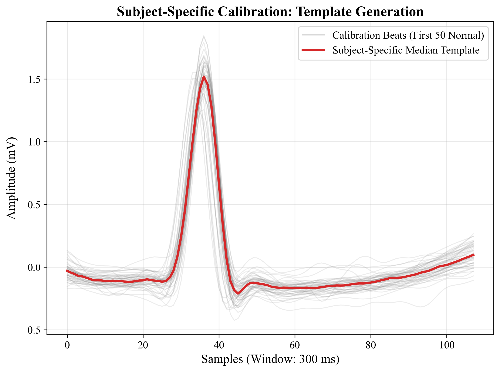
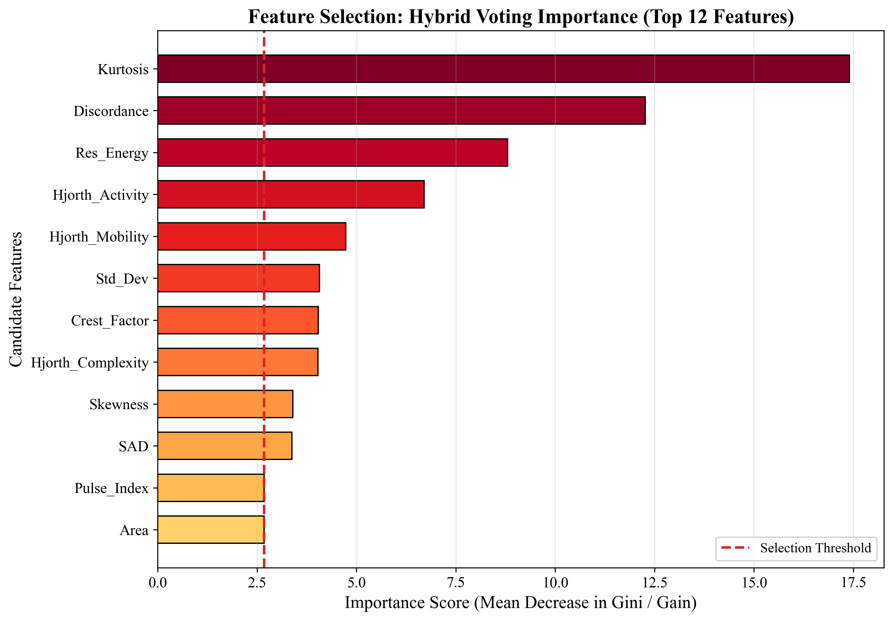
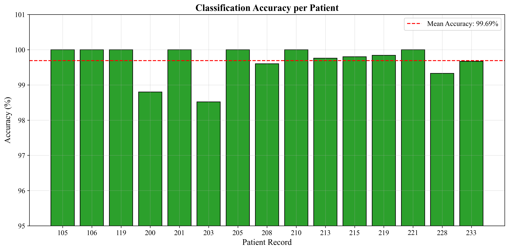
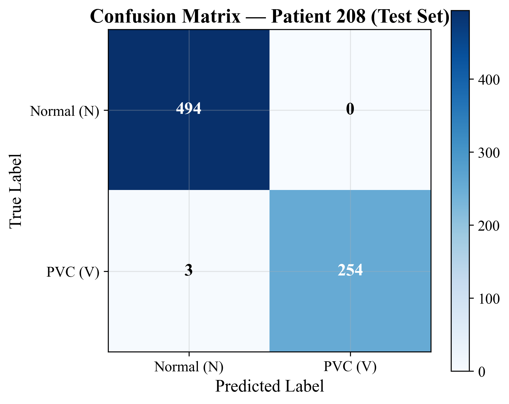
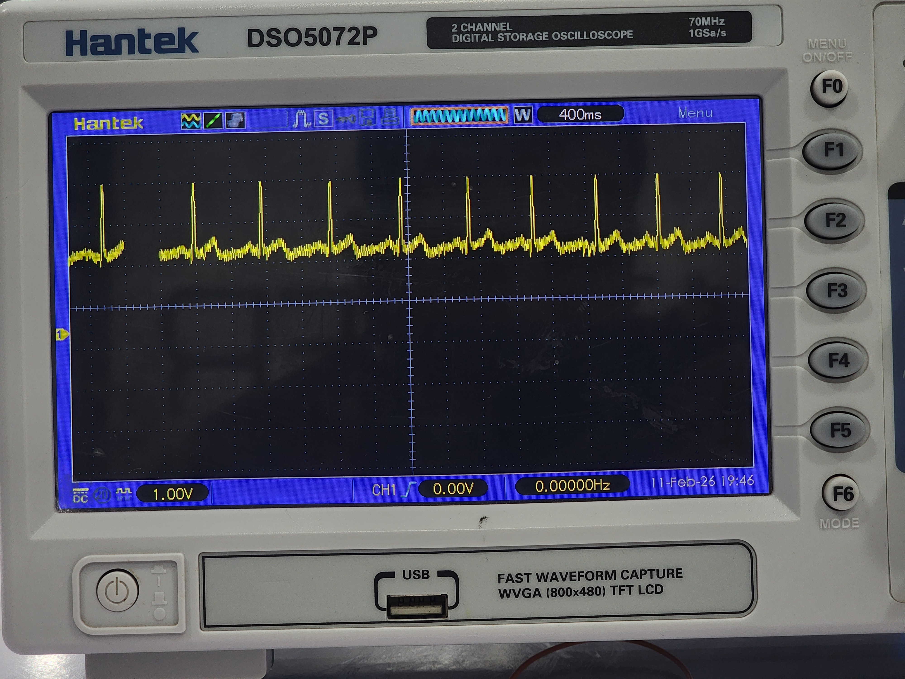

# Subject-Specific Premature Ventricular Contraction Detection Using Dual-Voting Feature Selection and Lightweight Decision Trees

[](LICENSE)
[](https://www.python.org/)
[]()
[](https://physionet.org/content/mitdb/1.0.0/)

Research Study & Embedded Machine Learning Pipeline  
Author: Abdulaziz K. A. Hatem, B.Eng.  
Department of Biomedical Engineering, University of Science and Technology, Aden, Yemen  
Manuscript Prepared for: *International Journal of Online and Biomedical Engineering (iJOE)*

---

## 1. Clinical Context & Motivation

Premature Ventricular Contractions (PVCs) are common cardiac arrhythmias characterized by abnormal, ectopic ventricular depolarizations that occur prior to the expected normal sinus beat. In clinical cardiology, quantifying the "PVC burden" (the percentage of daily heartbeats that are PVCs) is critical for assessing risks of ventricular tachycardia, cardiomyopathy, and sudden cardiac death.

Standard diagnostic Holter monitoring systems are often unavailable in low-resource and conflict-affected environments. In Yemen, for example, approximately 49% of healthcare facilities have been disrupted by protracted conflict, and over 35% of the population lacks reliable grid electricity. High-end multi-lead Holter monitors and cloud-based AI diagnostic pipelines are financially and practically inaccessible for local clinics.

### Technical Limitations of Existing Solutions
- **Generic (Cross-Patient) Models:** Most published ML models train on pooled patient data. Because cardiac waveform morphology differs dramatically across individuals, generic models must rely on overly broad decision boundaries, increasing false positives and false negatives.
- **Deep Learning Complexity:** Recent Convolutional Neural Networks (1D-CNN) and Transformer architectures achieve high benchmark scores, but their multi-megabyte parameter footprint and high power consumption cannot run locally on cheap, battery-powered 32-bit microcontrollers (such as the Espressif ESP32, which costs ~$4 and operates on <100 mA).

---

## 2. Scientific Methodology & System Architecture

This study introduces a personalized, edge-compatible classification pipeline that operates in four distinct stages:

```
[ Raw ECG Stream (360 Hz) ]
             │
             ▼
[ 1. Causal Bandpass Filtering & Segmentation ] ──> 3rd-order Butterworth (0.5 - 40 Hz), 300 ms Window
             │
             ▼
[ 2. Subject-Specific Calibration ] ──> Median of first 50 normal beats ('N') creates baseline template
             │
             ▼
[ 3. Dual-Voting Feature Selection ] ──> 32 Candidate Features ──> Top 12 via Random Forest + XGBoost
             │
             ▼
[ 4. Lightweight Decision Tree Classifier ] ──> Depth 1 to 8, <3 KB RAM, 20 μs latency per beat
             │
             ▼
[ Automated C++ Code Export for ESP32 Firmware ]
```

### Stage 1: Causal Filtering and 300 ms Segmentation
- **Causal Bandpass Filter:** Implemented using `scipy.signal.lfilter` (3rd-order Butterworth, $0.5\text{--}40.0\text{ Hz}$). We strictly avoided non-causal zero-phase filters (`filtfilt`) during streaming simulations to ensure that the filter only uses past and current samples, mirroring real-time microcontroller operation.
- **Asymmetric Windowing:** For each detected R-peak, an asymmetric window of $300\text{ ms}$ ($108\text{ samples}$ at $360\text{ Hz}$) is segmented: $100\text{ ms}$ pre-R peak and $200\text{ ms}$ post-R peak. This isolates the QRS complex and ST segment while discarding baseline noise.

### Stage 2: Subject-Specific Calibration
Before real-time classification begins, the system records the patient's first 50 consecutive normal sinus beats (`'N'`). We compute the **sample-by-sample median** of these 50 beats to generate an individualized normal QRS reference template. The median was chosen over the mean because it is inherently resistant to occasional noise spikes or baseline motion artifacts.


*Figure 1: Subject-specific reference template constructed from the median of 50 normal sinus beats.*

### Stage 3: Dual-Voting Feature Selection (32 down to 12)
We compute 32 candidate physiological features across four categories:
1. **Timing & RR-Intervals:** `Pre_RR`, `Post_RR`, `RR_Ratio`, `Local_RR_Avg`, `RR_Diff`, `Heart_Rate`. (PVCs typically occur prematurely, resulting in a shortened `Pre_RR` interval followed by a compensatory pause with a prolonged `Post_RR`).
2. **Morphological Metrics:** `Max_Val`, `Min_Val`, `Peak_to_Peak`, `Mean`, `Std_Dev`, `RMS`, `Area`, `Energy`, `Line_Length`, `Steepness`, `Pulse_Index`, `Crest_Factor`, `Form_Factor`, `Skewness`, `Kurtosis`.
3. **Hjorth Signal Complexity:** `Hjorth_Activity`, `Hjorth_Mobility`, `Hjorth_Complexity`.
4. **Template Disparity Metrics:** `SAD` (Sum of Absolute Differences), `Corr_Coeff` (Pearson correlation with the subject's normal template), `Max_Dev`, `Energy_Ratio`, `Temp_Energy_Ratio`, `Discordance`, `Res_Energy` (Residual energy), `ZCR` (Zero Crossing Rate).

To optimize the model for embedded microcontrollers, we developed a **Dual-Voting** feature selection strategy. We rank feature importance across both **Random Forest** (Gini impurity decrease) and **XGBoost** (gain importance). The top 12 consensual features are retained, achieving a **62.5% reduction in dimensionality** without sacrificing sensitivity.


*Figure 2: Dual-voting feature importance rankings across Random Forest and XGBoost.*

### Stage 4: Lightweight Decision Tree & Chronological Split
The selected 12 features are classified using a shallow Decision Tree (`criterion='entropy', class_weight='balanced'`).
- **Validation Protocol:** We used a strict **70/30 Chronological Train/Test Split** for each patient record. The model trains on the first 70% of the patient's recording and is tested exclusively on the remaining 30% future beats. This completely eliminates temporal data leakage.

---

## 3. Experimental Results across 15 MIT-BIH Patients

The pipeline was evaluated on 15 patient records from the MIT-BIH Arrhythmia Database spanning a wide clinical spectrum of PVC burden: from low-burden patients (e.g., Record 105 with 1.6% PVCs) to high-burden cases (e.g., Record 208 with 38.5% PVCs).

| Patient Record | Training Beats ($N$) | Testing Beats ($N$) | Accuracy (%) | Sensitivity (%) | Specificity (%) | Decision Tree Depth |
| :---: | :---: | :---: | :---: | :---: | :---: | :---: |
| **105** | 1,759 | 754 | **100.0%** | **100.0%** | 100.0% | 5 |
| **106** | 1,383 | 593 | **100.0%** | **100.0%** | 100.0% | 2 |
| **119** | 1,341 | 575 | **100.0%** | **100.0%** | 100.0% | 2 |
| **200** | 1,741 | 747 | **98.8%** | **97.0%** | 99.8% | 6 |
| **201** | 1,240 | 532 | **100.0%** | **100.0%** | 100.0% | 1 |
| **203** | 2,042 | 876 | **98.5%** | **93.3%** | 99.2% | 8 |
| **205** | 1,813 | 778 | **100.0%** | **100.0%** | 100.0% | 1 |
| **208** | 1,750 | 751 | **99.6%** | **98.8%** | 100.0% | 2 |
| **210** | 1,792 | 769 | **100.0%** | **100.0%** | 100.0% | 6 |
| **213** | 1,966 | 844 | **99.8%** | **96.9%** | 100.0% | 3 |
| **215** | 2,313 | 992 | **99.8%** | **96.2%** | 100.0% | 2 |
| **219** | 1,465 | 629 | **99.8%** | **95.2%** | 100.0% | 3 |
| **221** | 1,656 | 710 | **100.0%** | **100.0%** | 100.0% | 1 |
| **228** | 1,391 | 597 | **99.3%** | **96.6%** | 100.0% | 3 |
| **233** | 2,091 | 897 | **99.7%** | **98.9%** | 100.0% | 4 |
| **Average** | **1,716** | **736** | **99.69%** | **98.19%** | **99.93%** | **3.3** |


*Figure 3: Individual testing accuracy across 15 patient records.*


*Figure 4: Confusion matrix breakdown illustrating near-zero false alarms.*

---

## 4. Edge Deployment & ESP32 Microcontroller Feasibility

To test whether this algorithm can run on low-cost hardware in Yemeni clinics, we converted the trained Decision Trees into pure C++ conditional branching statements via `src/export_to_cpp.py`.

```cpp
// Example C++ Logic Generated for Patient 208 (Tree Depth = 2)
int classify_beat(Features f) {
    if (f.Post_RR <= 0.655556f) {
        if (f.Pre_RR <= 0.444444f) {
            return 1; // Class PVC
        } else {
            return 0; // Class Normal
        }
    } else {
        return 1; // Class PVC
    }
}
```

### Computational Footprint on ESP32 (Tensilica Xtensa 32-bit LX6 @ 240 MHz):
- **RAM Footprint:** < 3 KB (dominated by the 108-sample circular buffer and 12 calculated features).
- **Execution Time:** ~20 microseconds per heartbeat for **decision tree inference** (the `if/else` traversal). Note: this does not include the upstream feature extraction computations (variance, Hjorth parameters, correlation coefficient), which would add additional processing time on the ESP32. Full end-to-end latency benchmarking on the physical ESP32 is planned as future work. At a heart rate of 1–2 Hz, the MCU sleeps >99% of the time, enabling multi-day battery operation on a single 18650 cell.
- **Zero External Dependencies:** Runs natively in bare-metal C++ without requiring Python, TensorFlow Lite, or an internet connection.

---

## 5. Hardware Signal Acquisition & Validation

To validate our signal acquisition front-end, we captured and analyzed raw ECG signals using a digital storage oscilloscope (Hantek DSO5072P) connected directly to our custom breadboard circuit.

The images below demonstrate a clear, high-quality ECG signal (with distinct QRS complexes) acquired through our analog front-end prior to any digital filtering on the ESP32.


*Figure 5: The complete hardware test setup including the analog front-end circuit, Arduino, and digital oscilloscope.*


*Figure 6: A close-up view of the raw ECG waveform on the oscilloscope, showing excellent signal clarity and distinct QRS complexes.*

---

## 6. Repository Structure

```text
ecg-pvc-detection-esp32/
├── README.md                      # Comprehensive academic study report
├── LICENSE                        # MIT License
├── requirements.txt               # Python package dependencies
├── environment.yml                # Conda environment definition
├── src/
│   ├── pvc_detection_pipeline.py  # Full training, calibration, and evaluation pipeline
│   └── export_to_cpp.py           # Transpiles trained decision tree into native C++
├── results/
│   ├── patient_results.csv        # Detailed per-patient performance metrics
│   └── feature_selection.json     # Feature importance rankings and selected indices
├── docs/
│   └── figures/                   # Publication figures from study
└── firmware/
    └── ESP32_Scientific_Firmware.cpp # C++ firmware header ready for ESP32
```

---

## 7. How to Run the Pipeline

```bash
# 1. Clone repository
git clone https://github.com/Abdulaziz-kh-Hatem/ecg-pvc-detection-esp32.git
cd ecg-pvc-detection-esp32

# 2. Install dependencies
pip install -r requirements.txt

# 3. Run the end-to-end patient evaluation pipeline
python src/pvc_detection_pipeline.py
```

---

## 8. Limitations & Future Work

- **Subject-Specific Calibration Requirement:** The current pipeline requires the first 50 heartbeats of each new patient to be confirmed as normal sinus rhythm (class `'N'`). In a clinical deployment, a physician or a pre-screening algorithm would need to verify these initial beats before the personalized template and classifier can be constructed. Developing a semi-supervised or transfer-learning approach to reduce this initial labeling burden is a key direction for future research.
- **Inference Time Reporting:** The reported ~20 μs execution time covers only the decision tree traversal (`if/else` branches). The full embedded pipeline — including real-time feature extraction (Hjorth parameters, correlation coefficients, RR-interval computations) — has not yet been benchmarked on the physical ESP32 hardware. End-to-end latency profiling is planned.
- **Validation Scope:** All results were obtained using the MIT-BIH Arrhythmia Database (PhysioNet). Prospective clinical validation on live patient data from low-resource settings has not yet been conducted.